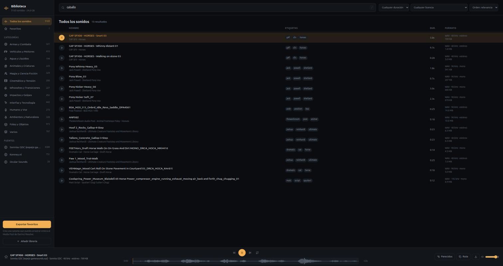

<div align="center">

# Sound Library

**Your own local sound-effects library, with a search engine that speaks your language — for DaVinci Resolve and any other editor.**

No subscriptions. Nothing uploaded to the cloud. Every sound commercially licensed and traceable.

[](LICENSE)




<sub>Searching `caballo` — Spanish for *horse* — across a library whose filenames are entirely in English.</sub>

</div>

---

## What this is

Sound-effects platforms charge €10–30 a month, and the day you stop paying you
lose the right to keep using what you already put in your videos.

This is the alternative. A script downloads thousands of **free, permanently
commercial-use** sounds, merges them into one library with metadata, and gives
you a local web app to search, audition and move them into your editor.

A typical install lands **~5,000 sounds and 16 hours of audio in about 24 GB**.

### Features

- **Search that speaks Spanish** even though the files are in English. Type
  `caballo` and it finds `Hoof_Gallop`, `Pony Whinny` and `FEETHors_Draft
  Horse`. Handles partial words (`caball`) and typos (`caballlo`).
- **12 auto-classified categories**: impacts, whooshes, UI, ambiences, foley,
  voice, cinematic, weapons, vehicles, magic & sci-fi, water, animals.
- **Similar sounds** via vector similarity — from one gallop it surfaces every
  other hoof and trot, even with no words in common.
- **Player** with waveform, seeking, looping and keyboard shortcuts.
- **Favourites** exported to a folder you drag straight into Resolve's Media Pool.
- **Licences always visible** and filterable, with an auto-generated
  `CREDITS.md` for anything requiring attribution.
- **Add your own libraries** from the interface or the terminal.

---

## Install

You need **Python 3.8+** and **ffmpeg**:

```bash
sudo apt install python3 ffmpeg git      # Debian/Ubuntu
brew install python3 ffmpeg git          # macOS
```

Then:

```bash
git clone https://github.com/VictorEscribano/biblioteca-de-sonidos.git
cd biblioteca-de-sonidos
./install.sh
```

The installer checks dependencies and disk space, downloads the libraries,
indexes everything and installs the desktop launcher. Expect 30 min to 2 h
depending on your connection — it's ~20 GB.

```bash
./install.sh --budget-gb 5      # lightweight install
./install.sh --skip-download    # only index what you already have
./install.sh --no-desktop       # skip the desktop icon
```

Downloads are **resumable**: Ctrl-C and relaunch picks up where it left off.

---

## Usage

Open the **Sound Library** icon, or from a terminal:

```bash
./sonidos            # opens http://sfx.localhost:7777
./sonidos estado     # summary of what you have
./sonidos index      # reindex after adding sounds
./sonidos icono      # reinstall the desktop launcher
```

| Action | How |
|---|---|
| Search | Type, or press <kbd>/</kbd> |
| Play | Click a row, or <kbd>space</kbd> |
| Navigate | <kbd>↑</kbd> <kbd>↓</kbd> through results |
| Favourite | Star on the row, or <kbd>F</kbd> |
| Find similar | Node icon on the row |
| Copy path | Copy icon on the row |

### Getting sounds into DaVinci Resolve

**The whole library, always available:** in Resolve's *Media Storage* panel,
browse to `library/` and add it as a favourite. It'll be in every project
without reimporting.

**A specific selection:** star what you want, hit *Export favourites*, and drag
the resulting folder into the Media Pool. It uses hard links, so it costs no
extra disk space.

### Adding your own libraries

From the interface, hit **"Add library"**: point it at a folder or `.zip`
already on your disk, name the vendor and licence, and it becomes its own
section under *Sources*. Nested zips are handled — download-centre bundles
often wrap everything in an outer archive.

From the terminal:

```bash
./sonidos add ~/Downloads/my-library.zip \
    --vendor "Studio name" \
    --license "Commercial royalty-free"
```

Nothing is copied — it links, so it costs no extra space.

---

## Where the sounds come from

| Source | Licence | Commercial use | Attribution |
|---|---|---|---|
| [Sonniss GDC Bundles](https://sonniss.com/gameaudiogdc) | Own royalty-free | Yes, unlimited | No |
| [Kenney.nl](https://kenney.nl/assets/category:Audio) | CC0 | Yes | No |
| [Freesound](https://freesound.org) (optional) | CC0 / CC-BY | Yes | CC-BY only |

Everything `install.sh` fetches is **commercial-use without attribution**. Add
Freesound and any CC-BY sounds are listed in `CREDITS.md` with author and link,
while the interface shows each sound's licence as it plays.

> [!IMPORTANT]
> Sonniss's licence explicitly prohibits using their audio to train AI models.

### Freesound (optional)

Adds ~1,700 curated sounds in original quality. Needs OAuth2 credentials from
<https://freesound.org/apiv2/apply>:

```bash
python3 tools/dl_freesound.py --setup
python3 tools/dl_freesound.py --run --budget-gb 5
./sonidos index
```

Respects their API limits (60 requests/minute, 2,000/day).

---

## How the search works

This was the hard part. The library is in English and uses abbreviated
[UCS](https://universalcategorysystem.com/) naming (`FEETHors_Draft Horse
Walk`, `VEHWagn_Wood Cart`), so searching `caballo` returned nothing and even
`horse` found only 6 of the 15 equine sounds present.

The trick is to **expand the documents at index time, not the queries**:

1. `tools/thesaurus.py` defines 109 concepts holding ~1,200 Spanish and English
   terms. Indexing `Hoof 2_Rocks_Gallop-4-Step` appends *caballo, horse,
   galope, relincho, casco, equino…*, so whatever you type is already literally
   in its search text.
2. UCS prefixes get split and translated: `FEETHors` → `feet` + `hors` →
   footsteps + horse.
3. At query time (`web/search.js`) three passes of decreasing precision run:
   exact token → prefix → trigram. Ranking is BM25, boosted when the match
   lands in the filename.
4. *Similar sounds* uses cosine similarity in TF-IDF space.

Across 5,165 sounds: 8,281 terms, index built in ~150 ms, queries in ~0.2 ms.
All in the browser, no search server.

---

## Layout

```
├── install.sh           installer
├── sonidos              launcher (abrir, index, estado, add, icono)
├── tools/
│   ├── categories.py    taxonomy and keyword classifier
│   ├── thesaurus.py     ES-EN thesaurus and UCS abbreviations
│   ├── build_index.py   dedupe, metadata, classification, index.json
│   ├── serve.py         local server (Range, export, import)
│   ├── crawl_gamesounds.py / dl_gamesounds.py / dl_kenney.py / dl_freesound.py
│   ├── add_pack.py      add your own libraries
│   └── install_desktop.sh
└── web/                 interface: HTML + CSS + JS, no dependencies
```

Generated content (`library/`, `_staging/`, `index.json`, `CREDITS.md`) is not
in the repo: this is the tool, you download your own audio.

### Design notes

- **Hard links instead of copies.** `library/` and `exports/` share inodes with
  `_staging/`, so the per-category structure doesn't duplicate ~20 GB.
- **Dedupe by size + hash of the first 256 KB.** Hashing 20 GB in full would be
  glacial, and for exact duplicates this is enough.
- **The server implements `Range` requests**, which `http.server` lacks. Without
  them the browser can't seek — it downloads the whole WAV before playing.
- **Waveforms are decoded in the browser** only for files under 10 MB; above
  that you get a plain bar.
- **The server listens on both loopback addresses.** `sfx.localhost` resolves to
  `::1` before `127.0.0.1`, and serving IPv4 only makes the browser eat a
  connection refusal before retrying.
- **`[hidden] { display: none !important }` is deliberate.** Any rule setting
  `display` outbeats the browser's default for the `hidden` attribute, which
  left the modal and player bar permanently visible.

---

## Contributing

Most valuable contributions, in order:

**Thesaurus terms.** This is what improves the tool most and is the easiest to
contribute. If you search for something and don't find it, open an issue with
the query and the sound you expected, or add the term to `tools/thesaurus.py`:

```python
["horse", "caballo", "equino", "pony", "hoof", "gallop", "relincho", ...],
```

Each group holds interchangeable terms across both languages. Two traps worth
knowing, both found by testing against real data and annotated in the code:

- **Ambiguous synonyms drag in noise.** `snort` sat in the horse concept and
  pulled in pigs; `plate` sat in the glass concept (via Spanish *plato*) and
  pulled in metal plates.
- **Vendor names contaminate.** A pack from *"Digital Rain Lab"* injected
  "water" and "rain" into every one of its files. That's why the pack name is
  indexed as literal text and never activates concepts.

**New sources.** If you know free commercial-use libraries that can be fetched
by script, open an issue. Be aware many sit behind Cloudflare and return 403
to `curl`.

**Categories and keywords** in `tools/categories.py`, if you spot
misclassifications.

### Before opening a PR

```bash
python3 -m py_compile tools/*.py     # Python syntax
node --check web/app.js              # JS syntax
python3 tools/build_index.py         # must exit 0
```

The project has no dependencies beyond `requests`, and the interface uses no
framework. Let's keep it that way.

---

## Licence

Code under [MIT](LICENSE). **Audio files are not covered by it** — each sound
keeps its original provider's licence. See the `CREDITS.md` generated on every
index build.
